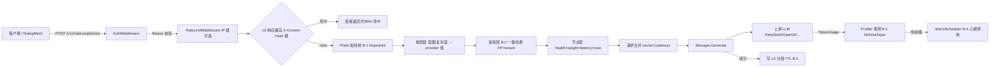
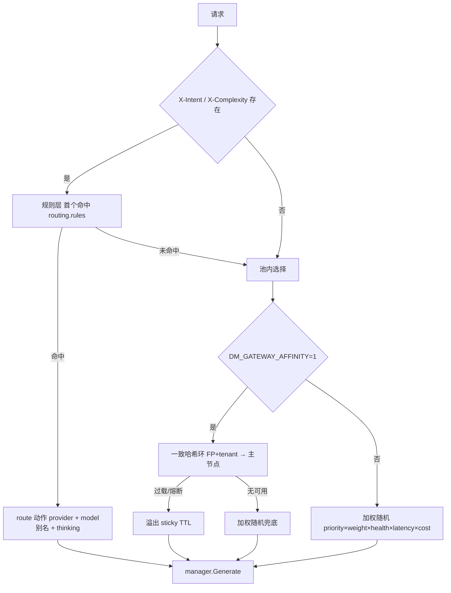
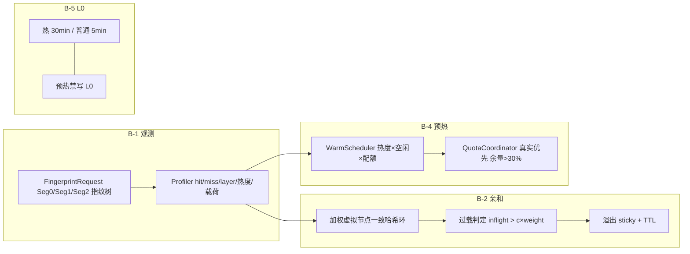
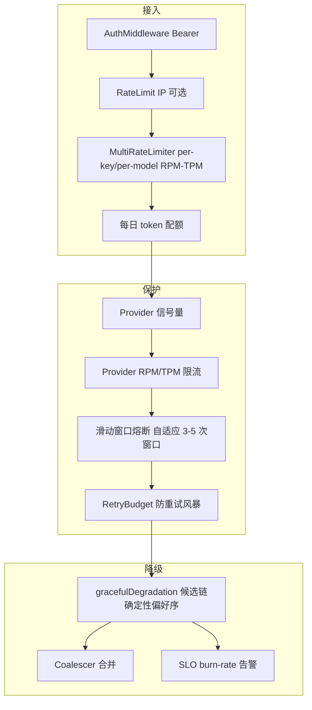
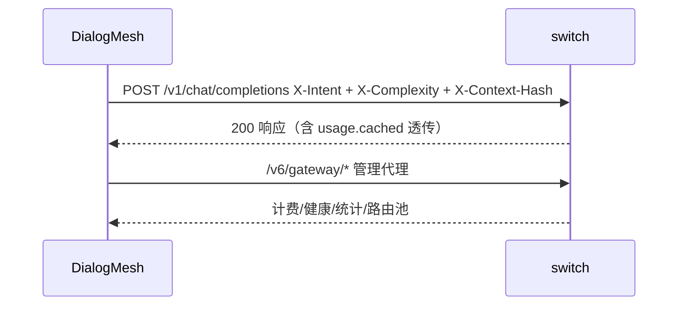

# switch 网关架构总览（2026-08-22 实现态）

> 对应实现: 智能路由（规则层+加权池）→ B-1 前缀指纹/观测 → B-2 亲和路由 →
> B-4 心跳预热 → B-5 L0 分层 TTL; 可靠性: 熔断/重试预算/请求合并/多级限流/
> SLO。设计基线: `CLOUD_CACHE_DESIGN_BASELINE_20260821.md`; 任务状态:
> `IMPLEMENTATION_ROADMAP_20260821.md`; 差距审计: `PRODUCTION_GAP_AUDIT_20260821.md`。

---

## 一、总体请求流

**文字说明**

- 请求先过认证 → 限流 → L0 缓存（键含 provider|model|api_key|X-Context-Hash,
  跨租户隔离）。命中直接返回, 0 上游调用。
- miss 后计算分层指纹（Seg0 system+tools / Seg1 history / Seg2 last）,
  规则层按 `X-Intent`/`X-Complexity` 命中 `routing.rules`（首个生效,
  可覆盖 provider/model 别名/thinking）。
- 规则未命中 → 亲和层（`DM_GATEWAY_AFFINITY=1` 时）: 一致哈希
  `sha256(FP+tenant)` → 环上健康且未过载节点, 过载走溢出 sticky;
  未启用亲和 → 池内加权随机（priority 分层 × weight × health × latency × cost）。
- 非流式同 cacheKey 并发经 Coalescer 合并为一次上游调用。
- 成功后写 L0（热前缀 30min / 普通 5min）, 并喂 Profiler（命中 token/
  层归属推断）; 热且空闲的前缀由 WarmScheduler 心跳预热。

---

## 二、智能路由决策

## 三、前缀缓存子系统（B-1~B-5）

**文字说明**

- **B-1**: 每个请求算分层指纹（sha256, 段内工具按 name 排序）; 上游返回后
  Profiler 记录命中/未命中 token, 并按各层 `token_len` 累加比对推断
  `hit_block_layer`（云侧只回数量, 不回层）。warmup 启用时才存预热载荷
  （16KB 截断, 1000 条有界淘汰）。
- **B-2**: 亲和键 = `sha256(FP + tenant)`, 环按 eligible provider 权重
  建 256×weight 虚拟节点; 冷启动直接哈希主节点; 过载（inflight > 1.25×weight）
  顺时针溢出, sticky TTL 防抖; 全挂回落加权随机。
- **B-4**: 热（近15min req≥10 或 hit≥100k）× 空闲（≥TTL×0.45）× 配额允许
  → 复用前缀 + 固定尾巴 `max_tokens=1` 只发亲和节点; 迟到（cached=0）计
  `warm_late`; 全局 2% 帽按全价测算。
- **B-5**: 高价值前缀 L0 TTL 30min, 普通 5min; 预热不经 HTTP 层天然不写 L0。

---

## 四、可靠性分层

**文字说明**

- 接入: Bearer 认证（admin 端点需 admin token）→ IP 限流（可选）→
  per-key/per-model RPM-TPM（`DM_GATEWAY_KEY_LIMIT`/`MODEL_LIMIT` +
  `/v1/admin/ratelimit`）→ 每日 token 配额。
- 保护: 每 provider 信号量 → RPM/TPM → 滑动窗口熔断（自适应 3-5 次窗口,
  恢复探测, half-open 成功回闭清窗）→ 连接重试前 `TryConsume` 重试预算。
- 降级: 上游失败按确定性偏好序走候选链（熔断靠后）; 同 key 并发合并;
  5xx 计失败喂 SLO, 超阈值日志告警。

## 五、观测

| 端点 | 内容 |
|------|------|
| `/v1/health` / `?live=1` | 健康缓存 / 实时探测 |
| `/v1/metrics` | Prometheus 格式（吞吐/延迟/缓存/熔断） |
| `/v1/stats` | 快照 + `slo`（burn rate）+ `affinity`（决策分布）+ `warmup`（计数） |
| `/v1/prefix/stats` | TopN 前缀命中观测（`hit_tokens_by_layer`） |
| `/v1/diagnostics` | provider 状态 + 路由规则 + prefix/coalescer/affinity 状态 |
| `/v1/usage` | 计费（per-key/per-model）+ 用量 |
| `/v1/error-catalog` | 错误码 → 含义 → 处置 |
| `/v1/admin/*` | providers / routing / ratelimit / reload |

## 六、模块清单

| 包 | 职责 |
|----|------|
| `server/` | 请求流: auth/路由/限流/缓存/合并/降级/SLO/admin/诊断 |
| `prefix/` | 缓存差异化: fingerprint / profiler / affinity / warmup / quota |
| `provider/` | 厂商抽象: manager/工厂/熔断/限流/计费/别名/代理 |
| `cache/` | L0 响应缓存 + 请求合并（Coalescer, per-entry TTL） |
| `observability/` | metrics / 异步日志 / tracing / SLO / exporter |
| `config/` | provider.yaml 解析 + watcher 热更新 + canary(实验) |
| `stream/` | SSE 流式聚合（tool_call 按 index 合并） |
| `persistence/` | 状态持久化（自动保存/恢复） |
| `token/` | token 估算 |
| `cmd/` | gateway / gtctl / gtui / gwbench / gwbench2 / mockupstream |

## 七、配置速查（env 开关）

| 变量 | 作用 |
|------|------|
| `DM_GATEWAY_AFFINITY=1` | B-2 亲和路由 |
| `DM_GATEWAY_AFFINITY_OVERLOAD` | 过载 c 值（默认 1.25） |
| `DM_GATEWAY_AFFINITY_OVERFLOW_TTL` | 溢出 sticky TTL 秒（默认 60） |
| `DM_GATEWAY_PREFIX_WARMUP=1` | B-4 预热（需亲和） |
| `DM_GATEWAY_WARMUP_INTERVAL/TRIGGER_REQ/IDLE` | 预热周期/热度/空闲 |
| `DM_GATEWAY_KEY_LIMIT` / `MODEL_LIMIT` | `name:rpm/tpm,` 多级限流 |
| `DM_GATEWAY_KEY_QUOTA_DAILY` | 每日 token 配额 |
| `DM_GATEWAY_RATE_LIMIT` | IP 限流 `rps/burst` |
| `DM_GATEWAY_REQUEST_LOG=0` | 关每请求日志 |
| `DM_GATEWAY_USAGE_LOG` | 计费 JSONL 路径 |

> DialogMesh 侧: `DM_PREFIX_STABILIZE=1` 启用 B-3 固化前缀
> （`core/agent/compiler/prefix_layout.py`）。

## 八、与 DialogMesh 协作

- DialogMesh 发送 `X-Intent`（LLM 分类意图）+ `X-Complexity`（消息量启发式）
  + `X-Context-Hash`（编译上下文稳定哈希）→ 网关规则层/亲和层/L0 使用。
- `DM_PREFIX_STABILIZE=1` 时 DialogMesh 对 P0-P3 去噪重排, 同逻辑上下文
  稳定命中。
- 价格同步: DialogMesh `api_gateway.py` 24h 拉取 LiteLLM 目录（含
  cache_read/cache_creation 成本 + 版本 diff）。

---

## 文档导航

- [设计基线 v1.2（缓存策略全量设计）](CLOUD_CACHE_DESIGN_BASELINE_20260821.md)
- [实现任务路径（阶段 0/1/2/3 状态）](IMPLEMENTATION_ROADMAP_20260821.md)
- [生产级差距审计（诚实版）](PRODUCTION_GAP_AUDIT_20260821.md)
- [L0 缓存子系统 + 测试策略（D1/D5）](L0_AND_TEST_DESIGN_20260821.md)
- [B-3 固化前缀契约（DialogMesh 编译器）](../../DialogMesh/docs/only/recall/PREFIX_CONTRACT_20260822.md)
- [压测报告（2026-08-20）](BENCH_20260820.md)
- [网关设计演进](BUSINESS_CHAIN_01_GATEWAY.md) · [DialogMesh 绑定](BINDING_DIALOGMESH.md)
