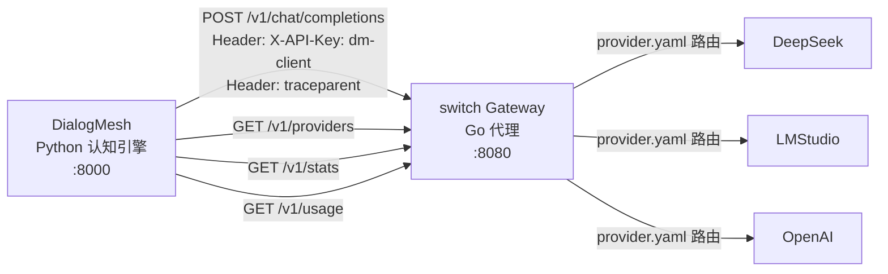

# DialogMesh ↔ switch Gateway — 协议绑定设计

> 版本: v1.0 | 日期: 2026-07-19
>
> 核心命题: DialogMesh 不再直连 LLM Provider——全部通过 switch gateway 代理。
> switch 负责断路器/限流/缓存/路由，DialogMesh 负责认知推理+上下文管理。

---

## 1. 架构



**原则**:
- DialogMesh 只认 switch 的地址和端口——不知道上游有哪些 Provider
- DialogMesh 用 switch 的 API Key（`dm-client`），不持有 Provider Key
- switch 的 `provider.yaml` 是唯一 Provider 配置源
- DialogMesh Python Gateway API 变成 switch 的**管理前端**

---

## 2. 通信协议

### 2.1 DialogMesh → switch: LLM 调用

```
POST http://127.0.0.1:8080/v1/chat/completions
Headers:
  Content-Type: application/json
  Authorization: Bearer dm-client
  traceparent: 00-{trace_id}-{span_id}-01
  X-Provider: deepseek          (可选: 指定 Provider)
  X-Priority: normal            (normal|low|critical)

Body:
{
  "model": "deepseek-chat",
  "messages": [
    {"role": "system", "content": "你是 DialogMesh 认知助手..."},
    {"role": "user", "content": "给这个模块加监控"}
  ],
  "max_tokens": 2000,
  "temperature": 0.3,
  "stream": false
}

Response:
{
  "id": "chatcmpl-xxx",
  "model": "deepseek-chat",
  "choices": [{"index": 0, "message": {"role": "assistant", "content": "..."}, "finish_reason": "stop"}],
  "usage": {"prompt_tokens": 500, "completion_tokens": 300, "total_tokens": 800}
}
```

### 2.2 DialogMesh 直连 → switch 代理 (代码变更)

```python
# 当前: core/agent/llm_providers/openai_provider.py
#   self._base_url = "https://api.deepseek.com/v1"
#   self._api_key = "sk-deepseek-key"

# 变更为:
#   self._base_url = "http://127.0.0.1:8080/v1"
#   self._api_key = "dm-client"  (switch 的 API Key)
#   self._model = "deepseek-chat"

# switch 根据 provider.yaml 路由到实际 Provider
# → 零代码改动（只改配置）
```

### 2.3 switch API → DialogMesh 查询

| switch 端点 | DialogMesh 用途 | 频率 |
|------------|----------------|:---:|
| `GET /v1/providers` | 获取可用 Provider+模型列表 → 前端显示 | 页面加载 |
| `GET /v1/stats` | Token 用量 + 成本 → 用量面板 | 每 30s |
| `GET /v1/usage` | 当前租户用量 → 用量面板 | 每次回复后 |
| `GET /v1/health` | 网关健康 → 状态栏 | 每 10s |

---

## 3. DialogMesh Python Gateway API 重定位

### 3.1 当前问题

```
DialogMesh python/api_gateway.py:
  - 自己维护 Provider 配置 (JSON 文件)
  - 自己管理 API Key
  - 自己实现健康检查
  → 与 switch provider.yaml 完全独立，两套配置
```

### 3.2 重定位：变成 switch 的管理前端

```
/v6/gateway/providers     → 代理 switch GET /v1/providers
/v6/gateway/providers/{n} → 代理 switch PUT /v1/admin/providers (配置 key/url)
/v6/gateway/active        → 读 provider.yaml 当前启用的 Provider
/v6/gateway/usage         → 代理 switch GET /v1/usage?api_key=dm-client
/v6/gateway/config        → 读 switch provider.yaml (或 /v1/diagnostics)

新增:
/v6/gateway/stats         → 代理 switch GET /v1/stats
/v6/gateway/health        → 代理 switch GET /v1/health
/v6/gateway/reload        → 代理 switch POST /v1/admin/reload
```

### 3.3 Provider 配置单一源

```
DialogMesh 不再维护 data/gateway/providers/*.json
→ 全部从 switch 的 provider.yaml 读取

启动时:
  DialogMesh.__init__():
    self._switch_url = "http://127.0.0.1:8080"
    self._switch_key = "dm-client"
    self._providers = self._fetch_providers_from_switch()

    def _fetch_providers_from_switch(self):
        resp = requests.get(f"{self._switch_url}/v1/providers",
                           headers={"Authorization": f"Bearer {self._switch_key}"})
        return resp.json()["providers"]
```

---

## 4. 追踪绑定

```
DialogMesh 每个 LLM 请求 → 生成 trace_id:
  from core.agent.v4.observability.tracing import TraceContext
  tc = TraceContext.new()
  headers["traceparent"] = tc.traceparent()

switch gateway:
  TracingMiddleware 提取 traceparent → 注入 context
  → 所有中间件日志带 trace_id
  → 返回给 DialogMesh 的 response 也带 trace_id

效果:
  一条用户请求 ←→ DialogMesh trace_id ←→ switch trace_id ←→ upstream trace
  全链路可追踪
```

---

## 5. 故障转移链

```
单 Provider 场景:
  DialogMesh → switch → DeepSeek
  如果 DeepSeek 超时 → switch 断路器 OPEN
    → switch 返回 503 "circuit open for deepseek"
    → DialogMesh 收到 503 → 显示 "服务暂时不可用"

多 Provider 场景 (provider.yaml 配置 LMStudio 为 fallback):
  DialogMesh → switch → DeepSeek (失败)
    → switch 自动降级到 LMStudio
    → DialogMesh 感知不到切换
    → response.headers["X-Provider"] = "lmstudio" (告知用了哪个)

DialogMesh 可选的 Provider 偏好:
  请求 Header: X-Provider: deepseek  → switch 只用这个
  无 Header → switch 按加权路由自动选
  请求 Header: X-Priority: critical → switch 同时发快+慢 Provider (hedging)
```

---

## 6. 配置示例

### 6.1 switch provider.yaml (已有)

```yaml
providers:
  - name: deepseek
    kind: openai_compatible
    base_url: https://api.deepseek.com
    api_key: sk-xxx
    models: [deepseek-chat, deepseek-reasoner]
    enabled: true
    max_concurrency: 100
    adaptive_concurrency: true
    retry_budget: 10

  - name: lmstudio
    kind: openai_compatible
    base_url: http://127.0.0.1:1234/v1
    api_key: lm-studio
    models: [nvidia/nemotron-3-nano-4b]
    enabled: true
    max_concurrency: 3

auth:
  api_keys:
    - dm-client    # DialogMesh 专用 Key
  admin_token: admin-test
```

### 6.2 DialogMesh config (新增)

```python
# core/agent/v4/runtime/config.py

SWITCH_GATEWAY_URL = "http://127.0.0.1:8080"
SWITCH_GATEWAY_KEY = "dm-client"

# 通过环境变量覆盖:
# SWITCH_GATEWAY_URL=http://gateway:8080
# SWITCH_GATEWAY_KEY=prod-dm-key
```

---

## 7. 调用链对比

### 7.1 当前 (无 switch)

```
DialogMesh
  └─ OpenAIProvider(api_key="sk-deepseek", base_url="https://api.deepseek.com")
       └─ HTTP → DeepSeek API
       
  问题:
    - API Key 硬编码在 Python 代码中
    - 无断路器 → 故障直接抛给用户
    - 无缓存 → 重复请求重复计费
    - 无加权路由 → 无法利用 LMStudio 分流
```

### 7.2 绑定后

```
DialogMesh
  └─ OpenAIProvider(api_key="dm-client", base_url="http://127.0.0.1:8080")
       └─ HTTP → switch gateway (:8080)
            ├─ 缓存命中? → 直接返回
            ├─ 未命中 → 加权路由选 Provider
            ├─ 信号量 → 速率限制 → 断路器
            ├─ HTTP → DeepSeek/LMStudio/...
            └─ 失败 → 故障转移

  优势:
    - DialogMesh 不持有 Provider Key
    - switch 负责所有容错
    - Provider 配置动态热重载 (5s)
    - 统一的可观测性 (trace_id 贯穿)
```

---

## 8. 实现步骤

| 步骤 | 内容 | 估时 |
|:----:|------|:---:|
| 1 | DialogMesh OpenAIProvider 支持指向 switch | 1h |
| 2 | api_gateway.py 代理 switch 端点 | 2h |
| 3 | traceparent 传播到 switch | 0.5h |
| 4 | switch provider.yaml 配 dm-client key | 0.5h |
| 5 | 集成测试: DialogMesh → switch → DeepSeek | 1h |
| 6 | 文档: GUI_API.md 更新 Gateway 部分 | 1h |
