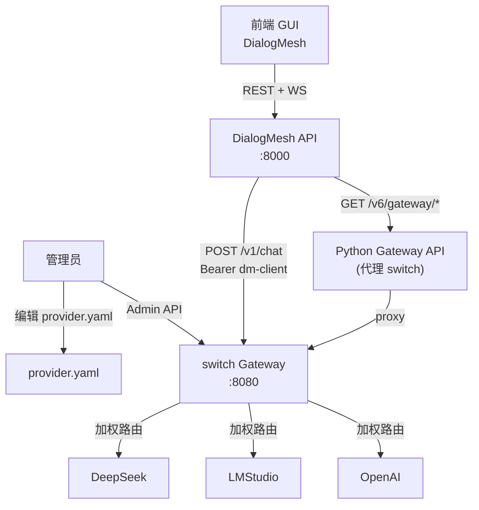
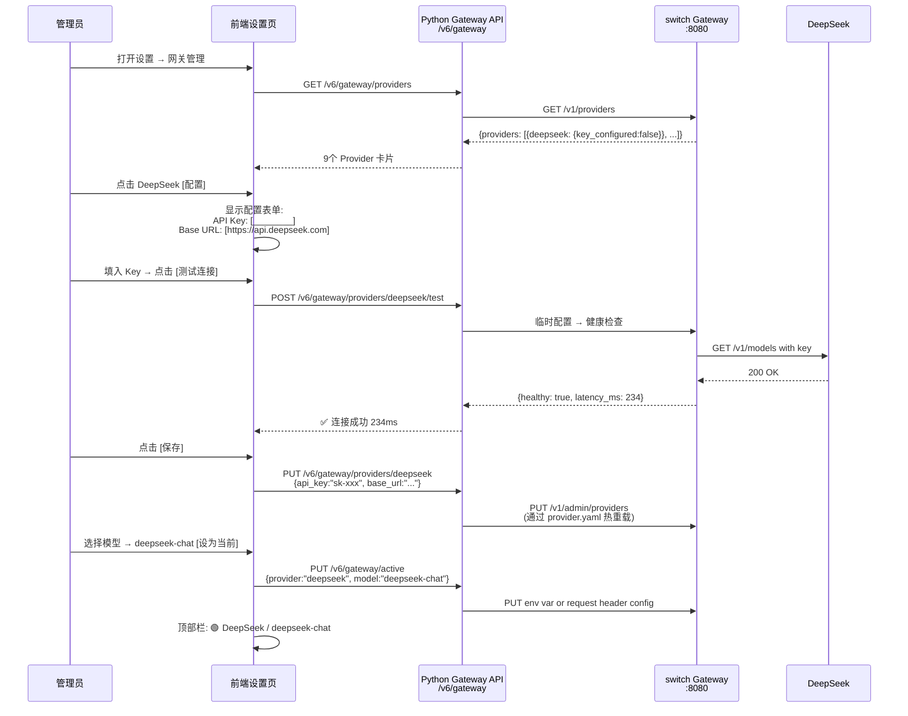
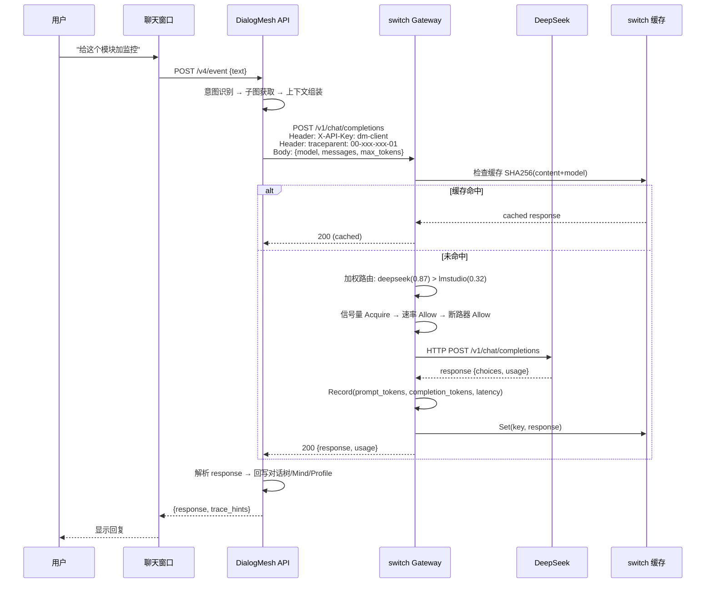
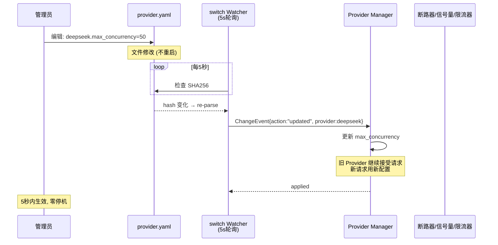

# switch Gateway — 完整业务流 · 前端交互视角

> 版本: v1.0 | 日期: 2026-07-19
>
> 三条主线：管理员配置 → 用户对话 → 监控运维。

---

## 1. 架构角色



---

## 2. 业务主线一：管理员配置 Provider

### 2.1 流程



### 2.2 涉及的 API

| 步骤 | 端点 | 说明 |
|:---:|------|------|
| 列表 | `GET /v6/gateway/providers` | 代理 switch `/v1/providers` |
| 测试 | `POST /v6/gateway/providers/{n}/test` | 临时 key → health check |
| 保存 | `PUT /v6/gateway/providers/{n}` | 写入 YAML + 触发热重载 |
| 切模型 | `PUT /v6/gateway/active` | 更新请求 Header `X-Provider` |

---

## 3. 业务主线二：用户对话（透明路由）

### 3.1 流程



### 3.2 用户无感知的容错

```
正常:  DialogMesh → switch → DeepSeek → 回复 (2s)
超时:  DialogMesh → switch → DeepSeek (超时 30s)
         → switch 断路器 OPEN (30s)
         → switch → LMStudio (自动降级)
         → 回复 (5s, 质量略低)
         → response header: X-Provider: lmstudio
         
DialogMesh 完全不感知切换——只拿到 response。
```

### 3.3 用户体验

| 场景 | 用户看到的 | 系统做的 |
|------|-----------|---------|
| 正常 | 回复 (2s) | 加权路由 → 最优 Provider |
| 重复问题 | 回复 (<50ms) | 缓存命中 |
| Provider 故障 | 回复 (5s, 可能提示"使用备选模型") | 断路器 → 降级 |
| 全部故障 | "服务暂时不可用" | 所有 Provider 耗尽 → 502 |
| 限流 | 回复 (排队) | 信号量等待 → 顺序放行 |

---

## 4. 业务主线三：监控运维

### 4.1 实时监控面板

```mermaid
sequenceDiagram
    participant UI as 监控面板
    participant PYGW as Python Gateway API
    participant SW as switch Gateway
    participant METRICS as switch Metrics

    loop 每10秒
        UI->>PYGW: GET /v6/gateway/health
        PYGW->>SW: GET /v1/health
        SW-->>PYGW: {status:"healthy"}
        PYGW-->>UI: 🟢 9 providers, 2 healthy
    end

    loop 每30秒
        UI->>PYGW: GET /v6/gateway/stats
        PYGW->>SW: GET /v1/stats
        SW->>METRICS: Snapshot()
        METRICS-->>SW: {requests, tokens, latency_p50/p95/p99, ...}
        SW-->>PYGW: MetricsSnapshot
        PYGW-->>UI: 更新仪表盘
    end

    UI->>UI: 显示:
      ├─ 请求量: 142/min
      ├─ Token: 450K (累计)
      ├─ P50延迟: 3.2s
      ├─ 缓存命中率: 23%
      ├─ 断路器: deepseek closed, lmstudio closed
      └─ 成本: $0.10 (本月)
```

### 4.2 用量 & 成本

| 查询 | API | 显示 |
|------|-----|------|
| 当前会话用量 | `GET /v6/gateway/usage` | 本轮 tokens + 费用 |
| 历史用量 | `GET /v1/usage?api_key=dm-client` | 本月/今日/累计 |
| 按 Provider | `GET /v1/stats` → errors_by_provider | 故障分布柱状图 |
| 按 Model | `GET /v1/stats` → requests_by_model | 模型使用占比 |

---

## 5. 网关配置热重载流程



---

## 6. SLO 告警流程

```mermaid
sequenceDiagram
    participant SW as switch Gateway
    participant SLO as SLO Monitor
    participant ALERT as 告警回调
    
    SW->>SLO: RecordSuccess/RecordFailure (每次请求)

    SLO->>SLO: 滑动窗口计算:
      short(1h): error_rate=2.1%
      long(6h):  error_rate=1.8%
      burn_rate = 2.1%/0.5% = 4.2x

    alt burn_rate > 14.4x (page)
        SLO->>ALERT: PAGE: DeepSeek 错误率飙升
        ALERT->>SW: 摘除 DeepSeek → 全量切 LMStudio
    else burn_rate > 6x (ticket)
        SLO->>ALERT: TICKET: 建议检查 DeepSeek 状态
    else burn_rate < 1x
        SLO->>SLO: 正常, 不告警
    end
```

---

## 7. 全链路追踪

```
用户请求 ID: req-abc123

  DialogMesh (trace_id: 00-a1b2-...-01)
    ├─ EventIR 解构: 2ms
    ├─ 意图识别: 15ms
    ├─ 上下文组装: 8ms
    └─ LLM 调用 → switch
         │
         switch (trace_id: 00-a1b2-...-01)  ← 同一个 trace_id
           ├─ AuthMiddleware: 0.5ms
           ├─ Cache.Check: 0.1ms (miss)
           ├─ WeightedRouter.Select: deepseek (0.87)
           ├─ Semaphore.Acquire: 0ms
           ├─ RateLimiter.Allow: 0.1ms
           ├─ CircuitBreaker.Allow: 0ms (closed)
           └─ DeepSeek HTTP: 3420ms
                └─ Response: 200 {completion_tokens: 800}
         
  DialogMesh (继续)
    └─ 回写对话树+Mind+Profile: 45ms

总耗时: 3492ms
  DialogMesh: 72ms
  switch: 0.7ms (overhead)
  DeepSeek: 3420ms (dominant)
```

---

## 8. 前端 API 映射总结

| 前端页面 | 使用的 API | 刷新频率 |
|---------|-----------|:---:|
| 设置-厂商管理 | `GET/PUT /v6/gateway/providers/{n}` | 手动 |
| 设置-连接测试 | `POST /v6/gateway/providers/{n}/test` | 手动 |
| 设置-模型选择 | `PUT /v6/gateway/active` | 手动 |
| 顶部状态栏 | `GET /v6/gateway/health` | 10s |
| 用量面板 | `GET /v6/gateway/usage` + `GET /v6/gateway/stats` | 30s |
| 监控仪表盘 | `GET /v6/gateway/stats` | 30s |
| 聊天窗口 | `POST /v4/event` | 每次用户输入 |

---

## 9. 安全模型

```
┌──────────────────────────────────────────────────┐
│ 安全层级                                          │
│                                                  │
│ 客户端 Key (dm-client):                           │
│   - POST /v1/chat/completions                     │
│   - GET /v1/providers                             │
│   - GET /v1/usage                                 │
│                                                  │
│ Admin Token (admin-test):                         │
│   - GET/POST /v1/admin/providers                  │
│   - POST /v1/admin/reload                         │
│   - GET /v1/diagnostics                           │
│                                                  │
│ 公开:                                             │
│   - GET /v1/health                                │
│   - GET /v1/metrics                               │
│   - GET /v1/stats                                 │
│                                                  │
│ Provider Key:                                     │
│   - 仅 switch 持有 (provider.yaml)                 │
│   - DialogMesh 不持有                              │
│   - 前端不暴露                                     │
└──────────────────────────────────────────────────┘
```
